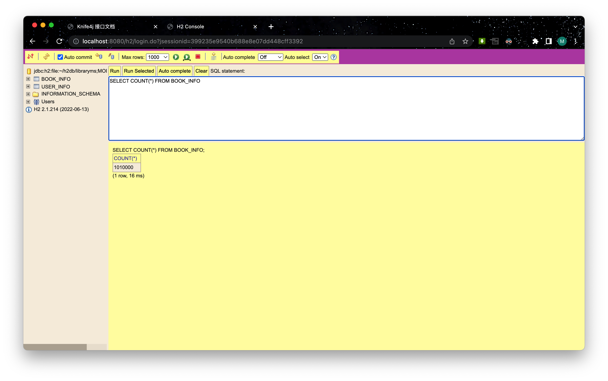
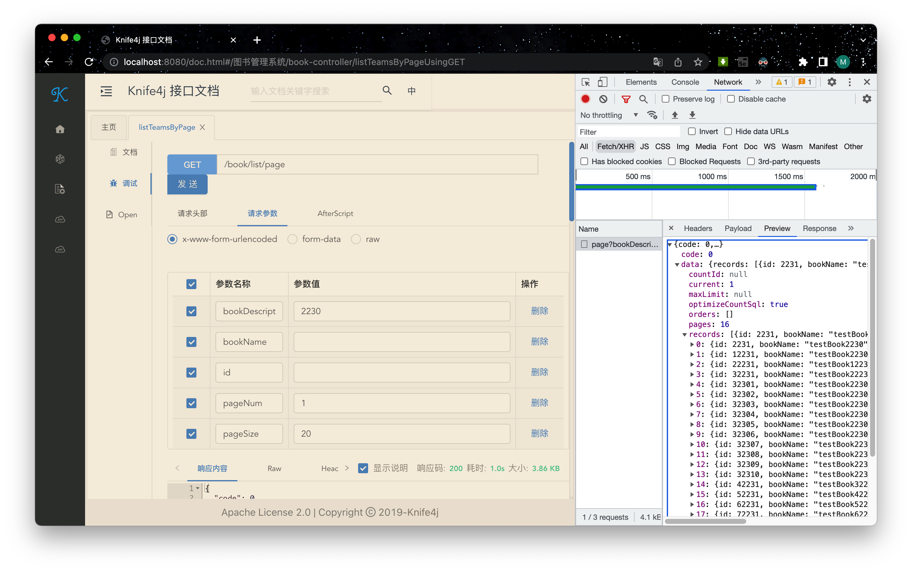
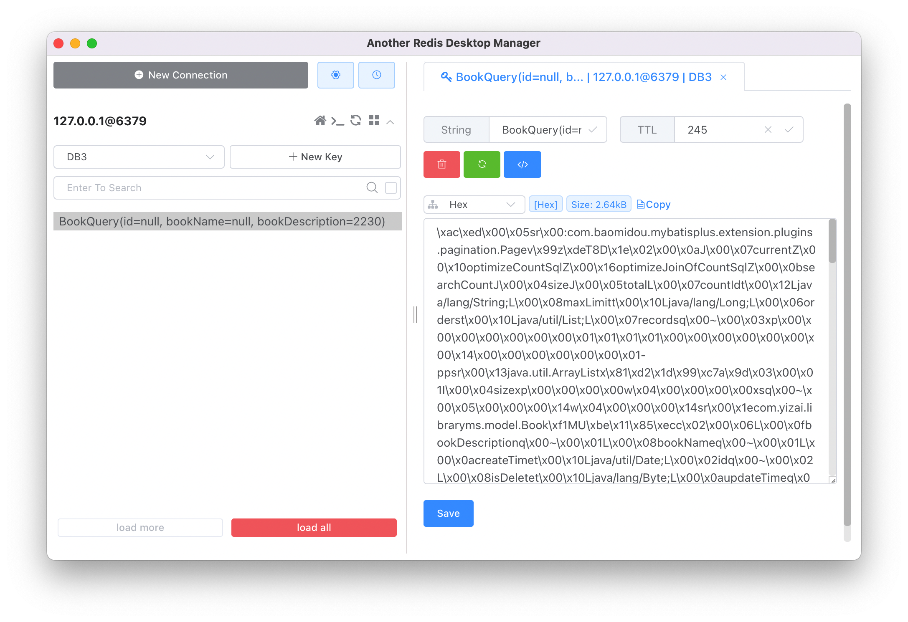
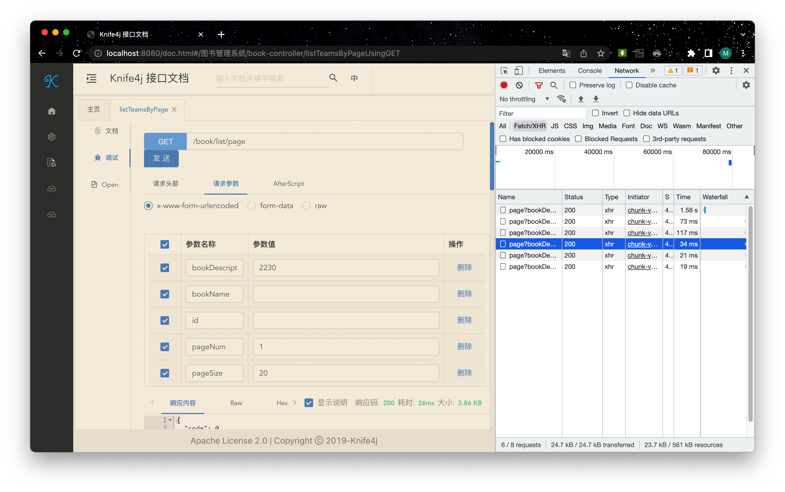

# **图书管理系统**

一个简单的图书管理系统后端。

@author：yizai

# 使用技术

开发框架：SpringBoot

ORM 框架：MyBatis-Plus

数据库：H2、Redis

日志：Lombok

接口文档：Knife4j

# 链接

接口文档：http://121.5.64.30:8080/doc.html

数据库：http://121.5.64.30:8080/h2

数据库用户名：sa，暂未设置密码

# 相关说明

## 用户注册和登录

- 管理员账号：admin
- 管理员密码：adminadmin

- 普通用户注册账号：不少于 4 位，只能包含数字、字母和下划线
- 普通用户注册密码：8 ～ 16 位字符
- 用户的登录信息通过 `request.getSession().setAttribute(USER_LOGIN_STATE, safetyUser)` 代码存储在服务器中

## 权限控制

- 仅管理员有增加、删除、修改图书的权限
- 管理员和用户均有查询图书的权限
- 实现方式：在增加、删除、修改操作时，通过代码 `request.getSession().getAttribute(USER_LOGIN_STATE)` 获取到当前登录的用户对象，进一步判断是否具有管理员权限。

## 缓存优化

- 向数据库中添加约 1000000 条数据，经测试分页查询接口的响应速度大于 1 秒。

  

  

- 通过 Redis 数据库实现缓存技术，在短时间内发起相同的查询请求时，除第一次查询响应较慢外，之后的请求均可直接从缓存中查询数据，查询速度为原来的至少 10 倍。

  

  

- 由于缓存空间有限，所以需要为 Redis 数据库中的每条数据设置过期时间。对于长时间未再次发起的请求，清除在缓存中的相应记录。例如，如果 5 分钟内未再次发起相同的请求，则 Redis 数据库自动删除相应的数据。

  ```java
  valueOperations.set(bookQuery.toString(), resultPage, 300000, TimeUnit.MILLISECONDS);
  ```

  

## 配置分离

- 使用 application.yml 文件，配置项目的开发环境。
- 创建 application-prod.yml 文件，配置项目的线上环境，在部署运行时可使用 `--spring.profiles.active=prod` 命令参数来激活配置。